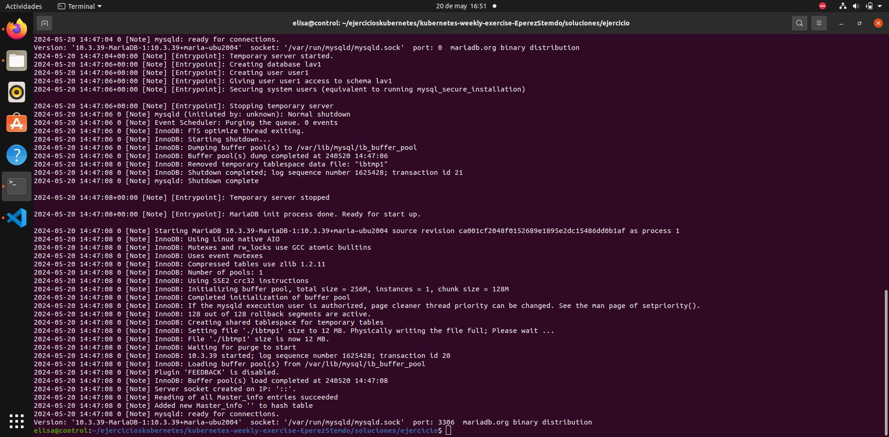
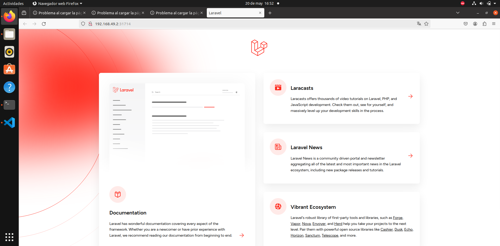
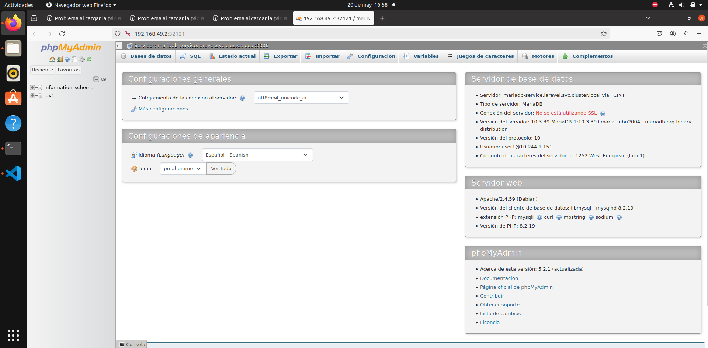

# Ejercicio semanal

## Apartado 1

Para la realización del ejercicio se han hecho dos deployments, uno para la base de datos MySQL y otro para la aplicación de laravel. Para ello se han utilizado las imágenes oficiales en sus últimas versiones. Éstas han sido: 
- ``mysql`` (https://hub.docker.com/_/mysql)
- ``bitnami:laravel`` (https://hub.docker.com/r/bitnami/laravel)

Se ha hecho un seguimiento de la documentación para configurar las variables de entorno.

### Creación del namespace 

Se crea un nuevo namespace llamado laravel en el que se crearán los recursos relacionados con la base de datos y laravel.

Para ello se utiliza el comando:

```
kubectl create namespace laravel
```

### Creación del deployment y servicio de MySQL

Se crea un deployment para la base de datos. Se ha hecho uso de ConfigMap para las variables de entorno y se han utilizado secretos para las contraseñas.

Una vez el pod se encuentra en estado ``running`` se crea un servicio de tipo ClusterIP.

Se comprueba a través de los logs que la base de datos funciona de manera correcta.




### Creación del deployment y servicio de Laravel

Se crean tanto el depoyment como el servicio de Laravel, en este caso de tipo NodePort.

Se comprueba a través de los logs del contenedor que funciona correctamente.


### Comprobación del servicio en el navegador

Finalmente se comprueba que todo funciona bien utilizando el comando:

```
minikube service laravel-svc
```




## Apartado 2

Para el segundo apartado se crea un nuevo namespace llamado ``phpmyadmin`` en el que se crearán los recursos relacionados con phpmyadmin.

Se crea un deployment y un service con las variables de entorno sacadas de la documentación (https://hub.docker.com/_/phpmyadmin?tab=description).

Una vez creados los recursos se comprueba en el navegador que todo está funcionando correctamente.

